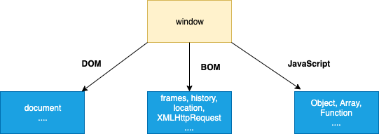

# JavaScript Interview Questions & Answers

> Agar sizga loyiha yoqsa :star: bosing. Texnik yangilanishlar uchun meni [@ssamir_20 Twitter](https://twitter.com/ssamir_20) <= || => [@ssamir_20 Instagram](https://www.instagram.com/ssamir_20/) kuzatib boring.

Maxsus savollarni kodlash uchun [Kodlash mashqlariga](#coding-exercise) o'ting.

## PDF/Epub formatlarini yuklab oling

Siz ushbu reponing PDF va Epub versiyasini [amallar yorlig'idagi](https://github.com/sulaymonov2002/javascript-interview-questions) so'nggi ishga tushirishdan yuklab olishingiz mumkin.

---

### Mundarija

| No. | Savollar                                                                                                                                                         |
| --- | ---------------------------------------------------------------------------------------------------------------------------------------------------------------- |
| 1   | [JavaScript-da ob'ektlarni yaratishning qanday usullari bor ?](#what-are-the-possible-ways-to-create-objects-in-javascript)                                      |
| 2   | [Prototype chain nima ?](#what-is-a-prototype-chain)                                                                                                             |
| 3   | [Call, Apply va Bind orasidagi farq nima ?](#what-is-the-difference-between-call-apply-and-bind)                                                                 |
| 4   | [JSON nima va uning umumiy operatsiyalari](#what-is-json-and-its-common-operations)                                                                              |
| 5   | [Massiv slice usulidan maqsad nima ?](#what-is-the-purpose-of-the-array-slice-method)                                                                            |
| 6   | [Massivni splice usulining maqsadi nima ?](#what-is-the-purpose-of-the-array-splice-method)                                                                      |
| 7   | [Slice va splice o'rtasidagi farq nima ?](#what-is-the-difference-between-slice-and-splice)                                                                      |
| 8   | [Ob'ekt va Map qanday taqqoslaysiz](#how-do-you-compare-object-and-map)                                                                                          |
| 9   | [== va === operatorlarning farqi nimada ?](#what-is-the-difference-between--and--operators)                                                                      |
| 10  | [lambda yoki arrow function nima ?](#what-are-lambda-or-arrow-functions)                                                                                         |
| 11  | [Birinchi class function nima ?](#what-is-a-first-class-function)                                                                                                |
| 12  | [Birinchi order function nima ?](#what-is-a-first-order-function)                                                                                                |
| 13  | [Yuqori tartibli funksiya nima ?](#what-is-a-higher-order-function)                                                                                              |
| 14  | [unary function nima ?](#what-is-a-unary-function)                                                                                                               |
| 15  | [currying function nima ?](#what-is-the-currying-function)                                                                                                       |
| 16  | [pure function nima ?](#what-is-a-pure-function)                                                                                                                 |
| 17  | [let kalit so'zining maqsadi nima ?](#what-is-the-purpose-of-the-let-keyword)                                                                                    |
| 18  | [let va var o'rtasidagi farq nima ?](#what-is-the-difference-between-let-and-var)                                                                                |
| 19  | [kalit so'zi sifatida let nomini tanlashning sababi nimada ?](#what-is-the-reason-to-choose-the-name-let-as-a-keyword)                                           |
| 20  | [swtich blockdagi o'zgarishlarni qanday qilib xatosiz qayta e'lon qilish mumkin ?](#how-do-you-redeclare-variables-in-switch-block-without-an-error)             |
| 21  | [Temporal Dead Zone nima ?](#what-is-the-temporal-dead-zone)                                                                                                     |
| 22  | [IIFE(darhol chaqiriladigan funksiya ifodasi)nima ?](#what-is-iifeimmediately-invoked-function-expression)                                                       |
| 23  | [JavaScript-da URL-manzilini decode yoki code lash mumkin ?](#how-do-you-decode-or-encode-a-url-in-javascript)                                                   |
| 24  | [Memoization nima ?](#what-is-memoization)                                                                                                                       |
| 25  | [Hoisting nima ?](#what-is-hoisting)                                                                                                                             |
| 26  | [ES6 da qanday sinflar mavjud ?](#what-are-classes-in-es6)                                                                                                       |
| 27  | [Closures nima ?](#what-are-closures)                                                                                                                            |
| 28  | [Modullar nima ?](#what-are-modules)                                                                                                                             |
| 29  | [Nima uchun sizga modullar kerak ?](#why-do-you-need-modules)                                                                                                    |
| 30  | [JavaScriptda scope nima ?](#what-is-scope-in-javascript)                                                                                                        |
| 31  | [Service worker nima ?](#what-is-a-service-worker)                                                                                                               |
| 32  | [Service worker yordamida DOMni qanday boshqarish mumkin ?](#how-do-you-manipulate-dom-using-a-service-worker)                                                   |
| 33  | [Service worker ni qayta ishga tushirishda ma'lumotdan qanday foydalanasiz ?](#how-do-you-reuse-information-across-service-worker-restarts)                      |
| 34  | [IndexedDB nima ?](#what-is-indexeddb)                                                                                                                           |
| 35  | [Web storage nima ?](#what-is-web-storage)                                                                                                                       |
| 36  | [Post xabari nima ?](#what-is-a-post-message)                                                                                                                    |
| 37  | [cookie nima ?](#what-is-a-cookie)                                                                                                                               |
| 38  | [Cookie nima uchun kerak ?](#why-do-you-need-a-cookie)                                                                                                           |
| 39  | [Cookie-da qanday variantlar mavjud ?](#what-are-the-options-in-a-cookie)                                                                                        |
| 40  | [Cookie faylini qanday o'chirish mumkin ?](#how-do-you-delete-a-cookie)                                                                                          |
| 41  | [Cookie, local storage va session storage o'rtasidagi farqlar qanday ?](#What-are-the-differences-between-cookie-local-storage-and-session-storage)              |
| 42  | [localStorage va sessionStorage o'rtasidagi asosiy farq nima ?](#what-is-the-main-difference-between-localstorage-and-sessionstorage)                            |
| 43  | [Veb-xotiraga qanday kirish mumkin ?](#how-do-you-access-web-storage)                                                                                            |
| 44  | [session storage qanday usullar mavjud ?](#what-are-the-methods-available-on-session-storage)                                                                    |
| 45  | [storage event nima va uning event handler ?](#what-is-a-storage-event-and-its-event-handler)                                                                    |
| 46  | [Nima uchun sizga web storage kerak ?](#why-do-you-need-web-storage)                                                                                             |
| 47  | [Web storage browser yordamini qanday tekshirish mumkin ?](#how-do-you-check-web-storage-browser-support)                                                        |
| 48  | [Web workers browser qo'llab-quvvatlashini qanday tekshirish mumkin ?](#how-do-you-check-web-workers-browser-support)                                            |
| 49  | [Web worker ga misol keltiring ?](#give-an-example-of-a-web-worker)                                                                                              |
| 50  | [DOM-da web worker larning cheklovlari qanday ?](#what-are-the-restrictions-of-web-workers-on-dom)                                                               |
| 51  | [Promise nima ?](#what-is-a-promise)                                                                                                                             |
| 52  | [Promise nimaga kerak ?](#why-do-you-need-a-promise)                                                                                                             |
| 53  | [Promise(ning) uchta holati nima?](#what-are-the-three-states-of-promise)                                                                                        |
| 54  | [Callback function nima ?](#what-is-a-callback-function)                                                                                                         |
| 55  | [Callback(lar) nimaga kerak ?](#why-do-we-need-callbacks)                                                                                                        |
| 56  | [Callback hell nima ?](#what-is-a-callback-hell)                                                                                                                 |
| 57  | [Server tomonidan yuborilgan event(lar) nima ?](#what-are-server-sent-events)                                                                                    |
| 58  | [Server tomonidan yuborilgan event bildirishnomalarini qanday qabul qilasiz ?](#how-do-you-receive-server-sent-event-notifications)                              |
| 59  | [Server tomonidan yuborilgan event(lar) uchun brauzer yordamini qanday tekshirish mumkin ?](#how-do-you-check-browser-support-for-server-sent-events)            |
| 60  | [Server yuborilgan event(lar) uchun qanday hodisalar mavjud](#what-are-the-events-available-for-server-sent-events)                                              |
| 61  | [Promise berishning asosiy qoidalari qanday](#what-are-the-main-rules-of-promise)                                                                                |
| 62  | [Callback(da) qayta callback nima ?](#what-is-callback-in-callback)                                                                                              |
| 63  | [Promise chaining nima ?](#what-is-promise-chaining)                                                                                                             |
| 64  | [Promise.all nima ?](#what-is-promiseall)                                                                                                                        |
| 65  | [Promise(da) poyga usulining maqsadi nima ?](#what-is-the-purpose-of-the-race-method-in-promise)                                                                 |
| 66  | [JavaScript(da) qat'iy rejim nima ?](#what-is-a-strict-mode-in-javascript)                                                                                       |
| 67  | [Strict mode nimaga kerak ?](#why-do-you-need-strict-mode)                                                                                                       |
| 68  | [Nima uchun sizga strict mode kerak ?](#how-do-you-declare-strict-mode)                                                                                          |
| 69  | [Qo‘sh undovdan maqsad nima ?](#what-is-the-purpose-of-double-exclamation)                                                                                       |
| 70  | [O'chirish operatorining maqsadi nima ?](#what-is-the-purpose-of-the-delete-operator)                                                                            |
| 71  | [typeof operator nima ?](#what-is-typeof-operator)                                                                                                               |
| 72  | [undefined property nima ?](#what-is-undefined-property)                                                                                                         |
| 73  | [null value nima ?](#what-is-null-value)                                                                                                                         |
| 74  | [Null va undefined o'rtasidagi farq nima ?](#what-is-the-difference-between-null-and-undefined)                                                                  |
| 75  | [eval nima ?](#What-is-eval)                                                                                                                                     |
| 76  | [Window va document o'rtasidagi farq nima ?](#what-is-the-difference-between-window-and-document)                                                                |
| 77  | [JavaScript(da) history(ga) qanday kirish mumkin ?](#how-do-you-access-history-in-javascript)                                                                    |
| 78  | [Caps lock tugmachasi yoqilgan yoki yo'qligini qanday aniqlash mumkin ?](#how-do-you-detect-caps-lock-key-turned-on-or-not)                                      |
| 79  | [isNaN nima ?](#what-is-isnan)                                                                                                                                   |
| 80  | [undeclared va undefined o'zgaruvchilari o'rtasidagi farqlar qanday ?](#what-are-the-differences-between-undeclared-and-undefined-variables)                     |
| 81  | [Global variables nima ?](#what-are-global-variables)                                                                                                            |
| 82  | [Global variabl(lar) bilan qanday muammolar bor ?](#what-are-the-problems-with-global-variables)                                                                 |
| 83  | [NaN property nima ?](#what-is-nan-property)                                                                                                                     |
| 84  | [isFinite funksiyasining maqsadi nima ?](#what-is-the-purpose-of-isfinite-function)                                                                              |
| 85  | [Event flow nima ?](#what-is-an-event-flow)                                                                                                                      |
| 86  | [Event bubbling nima ?](#what-is-event-bubbling)                                                                                                                 |
| 87  | [Event capturing nima ?](#what-is-event-capturing)                                                                                                               |
| 88  | [Qanday qilib JavaScript-dan foydalanib shaklni yuborasiz ?](#how-do-you-submit-a-form-using-javascript)                                                         |
| 89  | [Operating system tafsilotlarini qanday topish mumkin ?](#how-do-you-find-operating-system-details)                                                              |
| 90  | [Document load va DOMContentLoaded hodisalari o'rtasidagi farq nima ?](#what-is-the-difference-between-document-load-and-domcontentloaded-events)                |
| 91  | [Native, host va user objects o'rtasidagi farq nima ?](#what-is-the-difference-between-native-host-and-user-objects)                                             |
| 92  | [JavaScript code(ni) tuzatish uchun qanday vositalar yoki usullar qo'llaniladi ?](#what-are-the-tools-or-techniques-used-for-debugging-javascript-code)          |
| 93  | [Callbacks orqali promise(ning) qanday ijobiy va salbiy tomonlari bor ?](#what-are-the-pros-and-cons-of-promises-over-callbacks)                                 |
| 94  | [Attribute va property o'rtasidagi farq nima ?](#what-is-the-difference-between-an-attribute-and-a-property)                                                     |
| 95  | [Same-origin policy nima ?](#what-is-same-origin-policy)                                                                                                         |
| 96  | [Void 0 ning maqsadi nima ?](#what-is-the-purpose-of-void-0)                                                                                                     |
| 97  | [JavaScript kompilyatsiya qilingan yoki tarjima qilingan tilmi ?](#is-javascript-a-compiled-or-interpreted-language)                                             |
| 98  | [JavaScript case-sensitive harflarga sezgir tilmi ?](#is-javascript-a-case-sensitive-language)                                                                   |
| 99  | [Java va JavaScript o'rtasida bog'liqlik bormi?](#is-there-any-relation-between-java-and-javascript)                                                             |
| 100 | [event(lar) nima ?](#what-are-events)                                                                                                                            |
| 101 | [JavaScriptni kim yaratgan ?](#who-created-javascript)                                                                                                           |
| 102 | [preventDefault usulidan fodalanish nima ?](#what-is-the-use-of-preventdefault-method)                                                                           |
| 103 | [stopPropagation usulidan foydalanish nima ?](#what-is-the-use-of-stoppropagation-method)                                                                        |
| 104 | [Noto'g'ri foydalanishni qaytarish uchun qanday usullar mavjud ?](#what-are-the-steps-involved-in-return-false-usage)                                            |
| 105 | [BOM nima ?](#what-is-bom)                                                                                                                                       |
| 106 | [setTimeout(dan) qanday foydalanish kerak ?](#what-is-the-use-of-settimeout)                                                                                     |
| 107 | [setInterval(dan) qanday foydalanish kerak ?](#what-is-the-use-of-setinterval)                                                                                   |
| 108 | [Nima uchun JavaScript Single threaded deb hisoblanadi ?](#why-is-javascript-treated-as-single-threaded)                                                         |
| 109 | [Event delegation nima ?](#what-is-an-event-delegation)                                                                                                          |
| 110 | [ECMAScript nima ?](#what-is-ecmascript)                                                                                                                         |
| 111 | [JSON nima ?](#what-is-json)                                                                                                                                     |
| 112 | [JSON sintaksisi qoidalari qanday ?](#what-are-the-syntax-rules-of-json)                                                                                         |
| 113 | [JSON stringify nima maqsadda ishlatiladi ?](#what-is-the-purpose-json-stringify)                                                                                |
| 114 | [JSON string(ni) qanday parse qilasiz ?](#how-do-you-parse-json-string)                                                                                          |
| 115 | [JSON nimaga kerak ?](#why-do-you-need-json)                                                                                                                     |
| 116 | [PWAs nima ?](#what-are-pwas)                                                                                                                                    |
| 117 | [clearTimeout usulining maqsadi nima ?](#what-is-the-purpose-of-cleartimeout-method)                                                                             |
| 118 | [clearInterval usulining maqsadi nima ?](#what-is-the-purpose-of-clearinterval-method)                                                                           |
| 119 | [Javascriptda yangi sahifani qanday yo'naltirish mumkin ?](#how-do-you-redirect-new-page-in-javascript)                                                          |
| 120 | [Sring(da) substring mavjudligini qanday tekshirish mumkin ?](#how-do-you-check-whether-a-string-contains-a-substring)                                           |
| 121 | [Javascriptda elektron pochtani qanday tekshirish mumkin ?](#how-do-you-validate-an-email-in-javascript)                                                         |
| 122 | [Current url(ni) javascript bilan qanday olish mumkin ?](#how-do-you-get-the-current-url-with-javascript)                                                        |
| 123 | [Location object(ning) turli url xususiyatlari qanday ?](#what-are-the-various-url-properties-of-location-object)                                                |
| 124 | [JavaScript(da) query string value(sini) qanday olish mumkin ?](#how-do-get-query-string-values-in-javascript)                                                   |
| 125 | [Object(da) key mavjudligini qanday tekshirish mumkin ?](#how-do-you-check-if-a-key-exists-in-an-object)                                                         |
| 126 | [JavaScript(da) object(ni) qanday loop yoki enumerat qilasiz ?](#how-do-you-loop-through-or-enumerate-javascript-object)                                         |
| 127 | [Empty object(ni) qanday sinab ko'rasiz ?](#how-do-you-test-for-an-empty-object)                                                                                 |
| 128 | [Arguments object nima ?](#what-is-an-arguments-object)                                                                                                          |
| 129 | [Qanday qilib string(ning) birinchi harfini katta harf bilan yozish mumkin ?](#how-do-you-make-first-letter-of-the-string-in-an-uppercase)                       |
| 130 | [Loop(ning) qanday ijobiy va salbiy tomonlari bor ?](#what-are-the-pros-and-cons-of-for-loop)                                                                    |
| 131 | [Current date(ni) JavaScript(da) qanday ko'rsatasiz ?](#how-do-you-display-the-current-date-in-javascript)                                                       |
| 132 | [Ikki sana object(ni) qanday solishtirasiz ?](#how-do-you-compare-two-date-objects)                                                                              |
| 133 | [String(ning) boshqa string bilan boshlanishini qanday tekshirish mumkin ?](#how-do-you-check-if-a-string-starts-with-another-string)                            |
| 134 | [JavaScript(da) string(ni) qanday kesish mumkin ?](#how-do-you-trim-a-string-in-javascript)                                                                      |
| 135 | [JavaScript(da) key value qiymat juftligini qanday qo'shasiz ?](#how-do-you-add-a-key-value-pair-in-javascript)                                                  |
| 136 | ['!--' belgisi maxsus operatorni ifodalaydi](#is-the----notation-represents-a-special-operator)                                                                  |
| 137 | [O'zgaruvchilarga standart qiymatlarni qanday belgilash mumkin ?](#how-do-you-assign-default-values-to-variables)                                                |
| 138 | [Ko'p qatorli string(larni) qanday aniqlash mumkin ?](#how-do-you-define-multiline-strings)                                                                      |
| 139 | [App shell model nima ?](#what-is-an-app-shell-model)                                                                                                            |
| 140 | [Funktsiyalar uchun xususiyatlarni aniqlay olamizmi ?](#can-we-define-properties-for-functions)                                                                  |
| 141 | [Funksiya kutayotgan parametrlar sonini qanday topish mumkin ?](#what-is-the-way-to-find-the-number-of-parameters-expected-by-a-function)                        |
| 142 | [Polyfill nima ?](#what-is-a-polyfill)                                                                                                                           |
| 143 | [Break and continue statements nima ?](#what-are-break-and-continue-statements)                                                                                  |
| 144 | [Js labels nima ?](#what-are-js-labels)                                                                                                                          |
| 145 | [Declaration(larni) yuqorida saqlashning qanday afzalliklari bor ?](#what-are-the-benefits-of-keeping-declarations-at-the-top)                                   |
| 146 | [variable(larni) ishga tushirishning qanday afzalliklari bor ?](#what-are-the-benefits-of-initializing-variables)                                                |
| 147 | [New object yaratish uchun qanday tavfsiyalar mavud ?](#what-are-the-recommendations-to-create-new-object)                                                       |
| 148 | [JSON array(larini) qanday aniqlaysiz ?](#how-do-you-define-json-arrays)                                                                                         |
| 149 | [Tasodifiy butun sonlar qanday yaratiladi ?](#how-do-you-generate-random-integers)                                                                               |
| 150 | [Butun sonlarni diapazonda chop etish uchun tasodifiy funksiyasini yoza olasizmi ?](#can-you-write-a-random-integers-function-to-print-integers-with-in-a-range) |

1. ### What are the possible ways to create objects in JavaScript

   Quyidagi kabi JavaScriptda ob'ektlar yaratishning ko'plab usullari mavjud

   1. **Ob'ekt konstruktori:**

      Bo'sh ob'ektni yaratishning eng oddiy usuli Ob'ekt konstruktoridan foydalanishdir. Hozirgi vaqtda bunday yondashuv tavsiya etilmaydi.

      ```javascript
      var object = new Object();
      ```

   2. **Ob'ektni yaratish usuli:**

      Object ning yaratish usuli prototip ob'ektini parametr sifatida o'tkazish orqali yangi ob'ektni yaratadi

      ```javascript
      var object = Object.create(null);
      ```

   3. **Obyekt literal sintaksisi:**

      Ob'ektning so'zma-so'z sintaksisi (yoki ob'ektni ishga tushiruvchisi) jingalak qavslarga o'ralgan nom-qiymat juftlarining vergul bilan ajratilgan to'plamidir.

      ```javascript
      var object = {
           name: "Sudheer",
           age: 34
      };

      Ob'ektning so'zma-so'z xossalari qiymatlari har qanday ma'lumotlar turiga, jumladan massiv, funksiya va ichki o'rnatilgan ob'ektga ega bo'lishi mumkin.
      ```

      **Eslatma:** Bu ob'ektni yaratishning eng oson usuli

   4. **Function constructor:**

      Har qanday funktsiyani yarating va ob'ekt misollarini yaratish uchun yangi operatorni qo'llang,

      ```javascript
      function Person(name) {
        this.name = name;
        this.age = 21;
      }
      var object = new Person("Sudheer");
      ```

   5. **Function constructor with prototype:**

      Bu funktsiya konstruktoriga o'xshaydi, lekin u xususiyatlari va usullari uchun prototipdan foydalanadi,

      ```javascript
      function Person() {}
      Person.prototype.name = "Sudheer";
      var object = new Person();
      ```

      Bu funksiya prototipi bilan ob'ekt yaratish usuli bilan yaratilgan misolga teng va keyin ushbu funktsiyani misol va parametrlar bilan argument sifatida chaqirish.

      ```javascript
      function func() {}

      new func(x, y, z);
      ```

      **(OR)**

      ```javascript
      // Funktsiya prototipidan foydalanib yangi namuna yarating.
      var newInstance = Object.create(func.prototype)

      // Funktsiyani chaqiring
      var result = func.call(newInstance, x, y, z),

      // Agar natija null bo'lmagan ob'ekt bo'lsa, uni ishlating, aks holda faqat yangi misoldan foydalaning.
      console.log(result && typeof result === 'object' ? result : newInstance);
      ```

   6. **ES6 Class syntax:**

      ES6 ob'ektlarni yaratish uchun sinf xususiyatini taqdim etadi

      ```javascript
      class Person {
        constructor(name) {
          this.name = name;
        }
      }

      var object = new Person("Sudheer");
      ```

   7. **Singleton pattern:**

      Singleton - bu faqat bir marta yaratilishi mumkin bo'lgan ob'ekt. Uning konstruktoriga takroriy qo'ng'iroqlar bir xil misolni qaytaradi va shu bilan ular tasodifan bir nechta misollarni yaratmasligiga ishonch hosil qilish mumkin.

      ```javascript
      var object = new (function () {
        this.name = "Sudheer";
      })();
      ```

      **[⬆ Yuqoriga qaytish](#mundarija)**

2. ### What is a prototype chain

   **Prototype chaining** mavjudlari asosida yangi turdagi ob'ektlarni qurish uchun foydalaniladi. Bu sinfga asoslangan tilda merosga o'xshaydi.

   Ob'ekt namunasidagi prototip **Object.getPrototypeOf(object)** yoki \***\*proto\*\*** xususiyati orqali, konstruktorlar funksiyasidagi prototip esa **Object.prototype** orqali mavjud.

   

   **[⬆ Yuqoriga qaytish](#mundarija)**

3. ### What is the difference between Call, Apply and Bind

   Call qilish, Apply va Bind o'rtasidagi farqni quyidagi misollar bilan tushuntirish mumkin,

   **Call:** Call() usuli berilgan qiymatga ega funktsiyani va birma-bir taqdim etilgan argumentlarni chaqiradi.

   ```javascript
   var employee1 = { firstName: "John", lastName: "Rodson" };
   var employee2 = { firstName: "Jimmy", lastName: "Baily" };

   function invite(greeting1, greeting2) {
     console.log(
       greeting1 + " " + this.firstName + " " + this.lastName + ", " + greeting2
     );
   }

   invite.call(employee1, "Hello", "How are you?"); // Hello John Rodson, How are you?
   invite.call(employee2, "Hello", "How are you?"); // Hello Jimmy Baily, How are you?
   ```

   **Apply:** Berilgan qiymat bilan funktsiyani chaqiradi va argumentlarni massiv sifatida o'tkazishga imkon beradi.

   ```javascript
   var employee1 = { firstName: "John", lastName: "Rodson" };
   var employee2 = { firstName: "Jimmy", lastName: "Baily" };

   function invite(greeting1, greeting2) {
     console.log(
       greeting1 + " " + this.firstName + " " + this.lastName + ", " + greeting2
     );
   }

   invite.apply(employee1, ["Hello", "How are you?"]); // Hello John Rodson, How are you?
   invite.apply(employee2, ["Hello", "How are you?"]); // Hello Jimmy Baily, How are you?
   ```

   **bind:** har qanday miqdordagi argumentlarni o'tkazish imkonini beruvchi yangi funktsiyani qaytaradi

   ```javascript
   var employee1 = { firstName: "John", lastName: "Rodson" };
   var employee2 = { firstName: "Jimmy", lastName: "Baily" };

   function invite(greeting1, greeting2) {
     console.log(
       greeting1 + " " + this.firstName + " " + this.lastName + ", " + greeting2
     );
   }

   var inviteEmployee1 = invite.bind(employee1);
   var inviteEmployee2 = invite.bind(employee2);
   inviteEmployee1("Hello", "How are you?"); // Hello John Rodson, How are you?
   inviteEmployee2("Hello", "How are you?"); // Hello Jimmy Baily, How are you?
   ```

   Call qilish va apply berish bir-birini almashtirib turadi. Ikkalasi ham joriy funksiyani darhol bajaradi. Argumentlarni massiv yoki vergul bilan ajratilgan roʻyxatida yuborish osonroqmi, qaror qabul qilishingiz kerak. Call **vergul** uchun (ajratilgan ro'yxat) va **Massiv** uchun Apply ni davolash orqali eslashingiz mumkin.

   Holbuki, Bind yangi funksiyani yaratadi, unda bu birinchi parametr bind() ga o'tkaziladi.

   **[⬆ Yuqoriga qaytish](#mundarija)**

4. ### What is JSON and its common operations

   **JSON** bu `Douglas Crockford` tomonidan ommalashtirilgan JavaScript ob'ekt sintaksisiga asoslangan matnga asoslangan ma'lumotlar formatidir.

   **Parsing:** Satrni mahalliy ob'ektga aylantirish

   ```javascript
   JSON.parse(text);
   ```

   **Stringification:** mahalliy ob'ektni tarmoq bo'ylab uzatilishi uchun satrga aylantirish

   ```javascript
   JSON.stringify(object);
   ```

   **[⬆ Yuqoriga qaytish](#mundarija)**

5. ### What is the purpose of the array slice method

   **slice()** usuli massivdagi tanlangan elementlarni yangi massiv obyekti sifatida qaytaradi. U berilgan boshlang'ich argumentdan boshlanadigan elementlarni tanlaydi va oxirgi elementni qo'shmasdan berilgan ixtiyoriy yakuniy argumentda tugaydi. Agar siz ikkinchi argumentni o'tkazib yuborsangiz, u oxirigacha tanlaydi.

   Ushbu usulning ba'zi misollari:

   ```javascript
   let arrayIntegers = [1, 2, 3, 4, 5];
   let arrayIntegers1 = arrayIntegers.slice(0, 2); // returns [1,2]
   let arrayIntegers2 = arrayIntegers.slice(2, 3); // returns [3]
   let arrayIntegers3 = arrayIntegers.slice(4); //returns [5]
   ```

   **Eslatma:** Slice usuli asl massivni o'zgartirmaydi, lekin u kichik to'plamni yangi massiv sifatida qaytaradi.

   **[⬆ Yuqoriga qaytish](#mundarija)**

6. ### What is the purpose of the array splice method

   **Splice()** usuli qatorga elementlarni qo'shish/o'chirish uchun ishlatiladi va keyin olib tashlangan elementni qaytaradi. Birinchi argument qo'shish yoki o'chirish uchun massiv o'rnini belgilaydi, ixtiyoriy ikkinchi argument esa o'chirilishi kerak bo'lgan elementlar sonini ko'rsatadi. Har bir qo'shimcha argument massivga qo'shiladi.

   Ushbu usulning ba'zi misollari:

   ```javascript
   let arrayIntegersOriginal1 = [1, 2, 3, 4, 5];
   let arrayIntegersOriginal2 = [1, 2, 3, 4, 5];
   let arrayIntegersOriginal3 = [1, 2, 3, 4, 5];

   let arrayIntegers1 = arrayIntegersOriginal1.splice(0, 2); // returns [1, 2]; original array: [3, 4, 5]
   let arrayIntegers2 = arrayIntegersOriginal2.splice(3); // returns [4, 5]; original array: [1, 2, 3]
   let arrayIntegers3 = arrayIntegersOriginal3.splice(3, 1, "a", "b", "c"); //returns [4]; original array: [1, 2, 3, "a", "b", "c", 5]
   ```

   **Eslatma:** Splice usuli asl massivni o'zgartiradi va o'chirilgan massivni qaytaradi.

   **[⬆ Yuqoriga qaytish](#mundarija)**

7. ### What is the difference between slice and splice

   Jadval shaklidagi asosiy farqlardan ba'zilari

   | Slice                                              | Splice                                                                      |
   | -------------------------------------------------- | --------------------------------------------------------------------------- |
   | Asl massivni o'zgartirmaydi (o'zgarmas)            | Asl massivni o'zgartiradi (o'zgaruvchan)                                    |
   | Asl massivning pastki to'plamini qaytaradi         | O'chirilgan elementlarni massiv sifatida qaytaradi                          |
   | Massivdan elementlarni tanlash uchun foydalaniladi | Massivga/massivdan elementlarni kiritish yoki oʻchirish uchun foydalaniladi |

   **[⬆ Yuqoriga qaytish](#mundarija)**

8. ### How do you compare Object and Map

   **Ob'ektlar** **Map(ga)** o'xshaydi, chunki ikkalasi ham key(larni) qiymatlarga o'rnatish, ushbu qiymatlarni olish, key(larni) o'chirish va key(da) biror narsa saqlanganligini aniqlash imkonini beradi. Shu sababli, ob'ektlar tarixan Map(lar) sifatida ishlatilgan. Lekin muhim farqlar borki, ular ma'lum holatlarda Map(dan) foydalanishni afzal ko'radi.

   1. Ob'ektning key(lari) Strings va Symbols bo'lib, ular Map uchun har qanday qiymat, jumladan funktsiyalar, ob'ekt(lar) va har qanday primitive bo'lishi mumkin.
   2. Map(dagi) key(lar) tartiblangan, Ob'ektga qo'shilgan key(lar) esa yo'q. Shunday qilib, uni takrorlashda Map ob'ekti kalitlarni kiritish tartibida qaytaradi.
   3. Siz Map hajmini siz o'lcham xususiyati bilan osongina olishingiz mumkin, shu bilan birga Ob'ektdagi xususiyatlar soni qo'lda aniqlanishi kerak.
   4. Map takrorlanadigan va shuning uchun to'g'ridan-to'g'ri takrorlanishi mumkin, holbuki Ob'ektni takrorlash uchun uning key(larini) qandaydir tarzda olish va ularni takrorlash kerak.
   5. Ob'ektning prototipi bor, shuning uchun map(da) ehtiyot bo'lmasangiz, key(laringiz) bilan to'qnashishi mumkin bo'lgan standart key(lar) mavjud. ES5 dan boshlab map = Object.create(null) yordamida buni chetlab o'tish mumkin, lekin bu kamdan-kam hollarda amalga oshiriladi.
   6. Map key juftlarini tez-tez qo'shish va olib tashlashni o'z ichiga olgan scenarios yaxshiroq ishlashi mumkin.

   **[⬆ Yuqoriga qaytish](#mundarija)**

9. ### What is the difference between == and === operators

   JavaScript qat'iy (===, !==) va turga aylantiruvchi (==, !=) tenglikni taqqoslashni ta'minlaydi. Qattiq operatorlar o'zgaruvchining turini hisobga oladi, qat'iy bo'lmagan operatorlar esa o'zgaruvchilar qiymatlari asosida turni to'g'irlash/konvertatsiya qilishni amalga oshiradilar. Qattiq operatorlar har xil turlar uchun quyidagi shartlarga amal qiladilar,

   1. Ikki satr bir xil belgilar ketma-ketligi, bir xil uzunlik va tegishli pozitsiyalarda bir xil belgilarga ega bo'lsa, qat'iy tengdir.
   2. Ikki raqam son jihatdan teng bo'lsa, ular qat'iy tengdir. ya'ni bir xil raqam qiymatiga ega. Bunda ikkita alohida holat mavjud,
      1. NaN hech narsaga teng emas, shu jumladan NaN.
      2. Ijobiy va manfiy nollar bir-biriga teng.
   3. Ikki mantiqiy operand, agar ikkalasi ham to'g'ri yoki ikkalasi ham yolg'on bo'lsa, mutlaqo tengdir.
   4. Ikki ob'ekt bir xil ob'ektga tegishli bo'lsa, ular mutlaqo tengdir.
   5. Null va Undefined turlari === bilan teng emas, lekin == bilan teng. ya'ni, null===aniqlanmagan --> noto'g'ri, lekin null==aniqlanmagan --> rost

   Yuqoridagi holatlarni qamrab oluvchi ba'zi misollar,

   ```javascript
   0 == false   // true
   0 === false  // false
   1 == "1"     // true
   1 === "1"    // false
   null == undefined // true
   null === undefined // false
   '0' == false // true
   '0' === false // false
   []==[] or []===[] //false, refer different objects in memory
   {}=={} or {}==={} //false, refer different objects in memory
   ```

   **[⬆ Yuqoriga qaytish](#mundarija)**

10. ### What are lambda or arrow functions

    Arrow funtion funksiya ifodasi uchun qisqaroq sintaksis boʻlib, oʻziga xos **this, arguments, super yoki new.target** funksiyalariga ega emas.

    **[⬆ Yuqoriga qaytish](#mundarija)**

11. ### What is a first class function

    Javascriptda funksiyalar birinchi darajali ob'ektlardir. Birinchi darajali funktsiyalar bu tildagi funktsiyalar boshqa har qanday o'zgaruvchilar kabi ko'rib chiqilishini anglatadi.

    Masalan, bunday tilda funksiya boshqa funksiyalarga argument sifatida berilishi, boshqa funksiya tomonidan qaytarilishi va o‘zgaruvchiga qiymat sifatida berilishi mumkin. Misol uchun, quyidagi misolda tinglovchiga tayinlangan ishlov beruvchi funksiyalari

    ```javascript
    const handler = () => console.log("This is a click handler function");
    document.addEventListener("click", handler);
    ```

    **[⬆ Yuqoriga qaytish](#mundarija)**

12. ### What is a first order function

    Birinchi darajali funksiya boshqa funksiyani argument sifatida qabul qilmaydigan va funksiyani qaytarish qiymati sifatida qaytarmaydigan funksiyadir.

    ```javascript
    const firstOrder = () => console.log("I am a first order function!");
    ```

    **[⬆ Yuqoriga qaytish](#mundarija)**

13. ### What is a higher order function

    Yuqori tartibli funksiya boshqa funksiyani argument sifatida qabul qiladigan yoki funksiyani qaytarish qiymati yoki ikkalasini qaytaradigan funksiyadir.

    ```javascript
    const firstOrderFunc = () =>
      console.log("Hello, I am a First order function");
    const higherOrder = (ReturnFirstOrderFunc) => ReturnFirstOrderFunc();
    higherOrder(firstOrderFunc);
    ```

    **[⬆ Yuqoriga qaytish](#mundarija)**

14. ### What is a unary function

    Unary function (ya'ni, monadic) - aynan bitta argumentni qabul qiladigan funksiya. Bu funksiya tomonidan qabul qilingan bitta argumentni anglatadi.

    Unary function(ga) misol keltiraylik,

    ```javascript
    const unaryFunction = (a) => console.log(a + 10); // Add 10 to the given argument and display the value
    ```

    **[⬆ Yuqoriga qaytish](#mundarija)**

15. ### What is the currying function

    Currying - bu bir nechta argumentli funksiyani olish va uni har birida faqat bitta argumentga ega bo'lgan funksiyalar ketma-ketligiga aylantirish jarayoni. Currying matematik **Xaskell Karri** sharafiga nomlangan. Karringni qo'llash orqali n-ary funksiya uni birlik funksiyaga aylantiradi.

    Keling, n-ary funksiyasiga misol keltiraylik va u qanday qilib currying function(ga) aylanadi,

    ```javascript
    const multiArgFunction = (a, b, c) => a + b + c;
    console.log(multiArgFunction(1, 2, 3)); // 6

    const curryUnaryFunction = (a) => (b) => (c) => a + b + c;
    curryUnaryFunction(1); // returns a function: b => c =>  1 + b + c
    curryUnaryFunction(1)(2); // returns a function: c => 3 + c
    curryUnaryFunction(1)(2)(3); // returns the number 6
    ```

    Currying funtion(lari) **kodning qayta ishlatilishi** va **funktsional tarkibini** yaxshilash uchun juda yaxshi.

    **[⬆ Yuqoriga qaytish](#mundarija)**

16. ### What is a pure function

    **Pure funtion** - bu qaytariladigan qiymat faqat uning argumentlari bilan hech qanday nojo'ya ta'sirlarsiz aniqlanadigan funksiyadir. Ya'ni, agar siz bir xil argumentlarga ega bo'lgan funksiyani "n" soni va ilovadagi joylar soni "n" bilan chaqirsangiz, u har doim bir xil qiymatni qaytaradi.

    Keling, pure va impure function(lar) o'rtasidagi farqni ko'rish uchun misol keltiraylik,

    ```javascript
    //Impure
    let numberArray = [];
    const impureAddNumber = (number) => numberArray.push(number);
    //Pure
    const pureAddNumber = (number) => (argNumberArray) =>
      argNumberArray.concat([number]);

    //Display the results
    console.log(impureAddNumber(6)); // returns 1
    console.log(numberArray); // returns [6]
    console.log(pureAddNumber(7)(numberArray)); // returns [6, 7]
    console.log(numberArray); // returns [6]
    ```

    Yuqoridagi kod parchalariga ko'ra, **Push** funksiyasi massivni o'zgartirish va parametr qiymatidan mustaqil ravishda surish raqami indeksini qaytarish orqali o'zini impure. Boshqa tomondan, **Concat** massivni oladi va uni boshqa massiv bilan birlashtiradi va nojo'ya ta'sirlarsiz butunlay yangi massiv hosil qiladi. Bundan tashqari, qaytarish qiymati oldingi massivning birlashmasi hisoblanadi.

    Esingizda bo'lsin, Pure funtion(lari) muhim ahamiyatga ega, chunki ular side effects(ni) hech qanday nojo'ya ta'sirlarsiz va dependency injection ehtiyoj sezmasdan soddalashtiradi. Ular, shuningdek, qattiq bog'lanishdan qochishadi va hech qanday nojo'ya ta'sirlarga ega bo'lmasdan, ilovangizni buzishni qiyinlashtiradi. Ushbu tamoyillar ES6 ning **Immutability** kontseptsiyasi bilan birlashtirilib, **let(dan)** ko'ra **const** ga ustunlik beradi.

    **[⬆ Yuqoriga qaytish](#mundarija)**

17. ### What is the purpose of the let keyword

    `let` statement **block scope local variable**(ni) e'lon qiladi. Shunday qilib, let keyword bilan aniqlangan o'zgaruvchilar u ishlatiladigan block scope yoki ifoda bilan cheklangan. Holbuki, `var` keyword bilan e'lon qilingan o'zgaruvchilar o'zgaruvchini global miqyosda yoki blok doirasidan qat'i nazar, butun funktsiyaga lokal ravishda aniqlash uchun ishlatiladi.

    Foydalanishni ko'rsatish uchun misol keltiraylik,

    ```javascript
    let counter = 30;
    if (counter === 30) {
      let counter = 31;
      console.log(counter); // 31
    }
    console.log(counter); // 30 (because the variable in if block won't exist here)
    ```

    **[⬆ Yuqoriga qaytish](#mundarija)**

18. ### What is the difference between let and var

    Siz farqlarni jadval shaklida ko'rishingiz mumkin

    | var                               | let                                        |
    | --------------------------------- | ------------------------------------------ |
    | U JavaScript boshidan beri mavjud | ES6 ning bir qismi sifatida taqdim etilgan |
    | U function scope                  | U block scope                              |
    | O'zgaruvchilar hoisting bo'ladi   | Hoisted lekin ishga tushirilmagan          |

    Farqni ko'rish uchun misol keltiraylik,

    ```javascript
    function userDetails(username) {
      if (username) {
        console.log(salary); // undefined due to hoisting
        console.log(age); // ReferenceError: Cannot access 'age' before initialization
        let age = 30;
        var salary = 10000;
      }
      console.log(salary); //10000 (accessible to due function scope)
      console.log(age); //error: age is not defined(due to block scope)
    }
    userDetails("John");
    ```

    **[⬆ Yuqoriga qaytish](#mundarija)**

19. ### What is the reason to choose the name let as a keyword

    `let` - bu **Scheme** va **Basic** kabi dastlabki dasturlash tillari tomonidan qabul qilingan matematik bayonot. U imkon qadar `var` ga yaqin anʼanaviy keyword soʻz sifatida `let` soʻzini ishlatadigan oʻnlab boshqa tillardan olingan.

    **[⬆ Yuqoriga qaytish](#mundarija)**

20. ### How do you redeclare variables in switch block without an error

    Agar siz `switch block` o'zgaruvchilarni qayta e'lon qilishga harakat qilsangiz, u xatolarga olib keladi, chunki faqat bitta block mavjud. Masalan, quyidagi code block quyidagi kabi sintaksis xatosini keltirib chiqaradi,

    ```javascript
    let counter = 1;
    switch (x) {
      case 0:
        let name;
        break;

      case 1:
        let name; // SyntaxError for redeclaration.
        break;
    }
    ```

    Ushbu xatolikka yo'l qo'ymaslik uchun siz case bandi ichida ichki blok yaratishingiz va yangi blokli leksik muhitni yaratishingiz mumkin.

    ```javascript
    let counter = 1;
    switch (x) {
      case 0: {
        let name;
        break;
      }
      case 1: {
        let name; // No SyntaxError for redeclaration.
        break;
      }
    }
    ```

    **[⬆ Yuqoriga qaytish](#mundarija)**

21. ### What is the Temporal Dead Zone

    Temporal Dead Zone - bu JavaScript-da o'zgaruvchini let va const keyword so'zlari bilan e'lon qilishda yuzaga keladigan xatti-harakatlar, lekin var bilan emas. ECMAScript 6 da `let` yoki `const` o'zgaruvchisiga uning e'lon qilinishidan oldin (uning doirasi doirasida) kirish ReferenceError(ga) sabab bo'ladi. Bu sodir bo'ladigan vaqt oralig'i, o'zgaruvchining bog'lanishi yaratilishi va uning e'lon qilinishi o'rtasidagi vaqt oralig'i vaqtinchalik temporal dead zone deb ataladi.

    Keling, bu xatti-harakatni misol bilan ko'rib chiqaylik,

    ```javascript
    function somemethod() {
      console.log(counter1); // undefined
      console.log(counter2); // ReferenceError
      var counter1 = 1;
      let counter2 = 2;
    }
    ```

    **[⬆ Yuqoriga qaytish](#mundarija)**

22. ### What is IIFE(Immediately Invoked Function Expression)

    IIFE (Immediately Invoked Function Expression) bu JavaScript funksiyasi boʻlib, u aniqlangan zahoti ishga tushadi. Uning imzosi quyidagicha bo'ladi,

    ```javascript
    (function () {
      // logic here
    })();
    ```

    IFE-dan foydalanishning asosiy sababi ma'lumotlarning maxfiyligini olishdir, chunki IIFE ichida e'lon qilingan har qanday o'zgaruvchilarga tashqi dunyo kirishi mumkin emas. ya'ni, agar siz IIFE bilan o'zgaruvchilarga kirishga harakat qilsangiz, u quyidagi kabi xatoga yo'l qo'yadi,

    ```javascript
    (function () {
      var message = "IIFE";
      console.log(message);
    })();
    console.log(message); //Error: message is not defined
    ```

    **[⬆ Yuqoriga qaytish](#mundarija)**

23. ### How do you decode or encode a URL in JavaScript?

    `encodeURI()` funksiyasi URL manzilini kodlash uchun ishlatiladi. Bu funksiya parametr sifatida URL satrini talab qiladi va kodlangan qatorni qaytaradi.
    `decodeURI()` funksiyasi URL manzilini decode(lash) uchun ishlatiladi. Bu funksiya parametr sifatida kodlangan URL satrini talab qiladi va bu decode(langan) qatorni qaytaradi.

    **Eslatma:** Agar siz / kabi belgilarni kodlashni xohlasangiz `/ ? : @ & = + $ #` keyin `encodeURIComponent()` dan foydalanishingiz kerak.

    ```javascript
    let uri = "employeeDetails?name=john&occupation=manager";
    let encoded_uri = encodeURI(uri);
    let decoded_uri = decodeURI(encoded_uri);
    ```

    **[⬆ Yuqoriga qaytish](#mundarija)**

24. ### What is memoization

    Memoization - bu oldindan hisoblangan natijalarni keshlash orqali funksiyaning ishlashini oshirishga harakat qiladigan dasturlash usuli. Har safar xotirada saqlangan funksiya chaqirilganda, uning parametrlari keshni indekslash uchun ishlatiladi. Agar ma'lumotlar mavjud bo'lsa, uni butun funksiyani bajarmasdan qaytarish mumkin.Aks holda funksiya bajariladi va natija keshga qo'shiladi. Keling, xotira bilan funksiya qo'shishga misol keltiraylik,

    ```javascript
    const memoizAddition = () => {
      let cache = {};
      return (value) => {
        if (value in cache) {
          console.log("Fetching from cache");
          return cache[value]; // Here, cache.value cannot be used as property name starts with the number which is not a valid JavaScript  identifier. Hence, can only be accessed using the square bracket notation.
        } else {
          console.log("Calculating result");
          let result = value + 20;
          cache[value] = result;
          return result;
        }
      };
    };
    // returned function from memoizAddition
    const addition = memoizAddition();
    console.log(addition(20)); //output: 40 calculated
    console.log(addition(20)); //output: 40 cached
    ```

    **[⬆ Yuqoriga qaytish](#mundarija)**

25. ### What is Hoisting

    Hoisting JavaScript mexanizmi bo'lib, unda code bajarilishidan oldin o'zgaruvchilar, funksiya deklaratsiyasi va sinflar o'z doirasining yuqori qismiga ko'chiriladi. Esda tutingki, JavaScript faqat deklaratsiyalarni hoisting, ishga tushirishni emas. Keling, o'zgaruvchan yuk ko'tarishning oddiy misolini olaylik,

    ```javascript
    console.log(message); //output : undefined
    var message = "The variable Has been hoisted";
    ```

    Yuqoridagi code tarjimon uchun quyidagi kabi ko'rinadi,

    ```javascript
    var message;
    console.log(message);
    message = "The variable Has been hoisted";
    ```

    Xuddi shu tarzda, funksiya deklaratsiyasi ham hoisting bo'ladi.

    ```javascript
    message("Good morning"); //Good morning

    function message(name) {
      console.log(name);
    }
    ```

    Ushbu hoisting funksiyalarni e'lon qilinishidan oldin code(da) xavfsiz ishlatishga imkon beradi.

    **[⬆ Yuqoriga qaytish](#mundarija)**

26. ### What are classes in ES6

    ES6-da Javascript clas(lar) asosan JavaScript-ning mavjud prototipiga asoslangan merosiga nisbatan syntactic sugar hisoblanadi.
    Masalan, prototipga asoslangan meros quyidagi funksiya ifodasida yozilgan,

    ```javascript
    function Bike(model, color) {
      this.model = model;
      this.color = color;
    }

    Bike.prototype.getDetails = function () {
      return this.model + " bike has" + this.color + " color";
    };
    ```

    ES6 classes esa muqobil sifatida belgilanishi mumkin

    ```javascript
    class Bike {
      constructor(color, model) {
        this.color = color;
        this.model = model;
      }

      getDetails() {
        return this.model + " bike has" + this.color + " color";
      }
    }
    ```

    **[⬆ Yuqoriga qaytish](#mundarija)**

27. ### What are closures

    Closure - bu funksiya va ushbu funksiya e'lon qilingan leksik muhitning kombinatsiyasi. ya'ni, bu tashqi yoki qo'shuvchi funksiya o'zgaruvchilariga kirish huquqiga ega bo'lgan ichki funksiya. Yopish uchta ko'lamli zanjirga ega

    1. O'zgaruvchilar uning own scope orasida aniqlangan o'z doirasi
    2. Tashqi funksiya o'zgaruvchilari
    3. Global o'zgaruvchilar

    Keling, yopish kontseptsiyasiga misol keltiraylik,

    ```javascript
    function Welcome(name) {
      var greetingInfo = function (message) {
        console.log(message + " " + name);
      };
      return greetingInfo;
    }
    var myFunction = Welcome("John");
    myFunction("Welcome "); //Output: Welcome John
    myFunction("Hello Mr."); //output: Hello Mr.John
    ```

    Yuqoridagi kodga ko'ra, ichki funksiya (ya'ni, greetingInfo) tashqi funksiya qaytganidan keyin ham tashqi funksiya doirasidagi (ya'ni Welcome) o'zgaruvchilarga kirish huquqiga ega.

    **[⬆ Yuqoriga qaytish](#mundarija)**

28. ### What are modules

    Modullar mustaqil, qayta foydalanish mumkin bo'lgan kodning kichik birliklariga ishora qiladi va ko'plab JavaScript dizayn patterns asosi bo'lib xizmat qiladi. JavaScript modullarining aksariyati ob'ektni, funksiyani yoki konstruktorni eksport qiladi

    **[⬆ Yuqoriga qaytish](#mundarija)**

29. ### Why do you need modules

    Quyida JavaScript ekotizimidagi modullardan foydalanishning afzalliklari ro'yxati keltirilgan

    1. Maintainability
    2. Reusability
    3. Namespacing

    **[⬆ Yuqoriga qaytish](#mundarija)**

30. ### What is scope in javascript

    Qo'llash doirasi - bu ish vaqtida kodingizning ma'lum bir qismidagi o'zgaruvchilar, funksiyalar va ob'ektlarga kirish imkoniyati. Boshqacha qilib aytganda, qamrov sizning kodingiz sohalarida o'zgaruvchilar va boshqa resurslarning ko'rinishini aniqlaydi.

    **[⬆ Yuqoriga qaytish](#mundarija)**

31. ### What is a service worker

    Xizmat xodimi asosan fonda ishlaydigan script (JavaScript fayli), veb-sahifadan ajratilgan va veb-sahifa yoki foydalanuvchining oʻzaro taʼsirini talab qilmaydigan xususiyatlarni taqdim etadi. Xizmat xodimlarining asosiy xususiyatlaridan ba'zilari - bu boy offline tajribalar (offline birinchi veb-ilovalarni ishlab chiqish), davriy fon sinxronizatsiyasi, push-bildirishnomalar, tarmoq so'rovlarini ushlab turish va boshqarish va javoblar keshini dasturiy ravishda boshqarish.

    **[⬆ Yuqoriga qaytish](#mundarija)**

32. ### How do you manipulate DOM using a service worker

    Xizmat xodimi DOMga bevosita kira olmaydi. Lekin u `postMessage` interfeysi orqali yuborilgan xabarlarga javob berish orqali o‘zi boshqaradigan sahifalar bilan bog‘lana oladi va bu sahifalar DOMni boshqarishi mumkin.

    **[⬆ Yuqoriga qaytish](#mundarija)**

33. ### How do you reuse information across service worker restarts

    Service worker bilan bog'liq muammo shundaki, u foydalanilmaganda tugatiladi va keyingi kerak bo'lganda qayta ishga tushadi, shuning uchun siz xizmat ko'rsatuvchi xodimning `onfetch` va `onmessage` ishlov beruvchilarida global holatga tayanolmaysiz. Bunday holda, xizmat ko'rsatuvchi xodimlar qayta ishga tushirishda davom etish va qayta foydalanish uchun IndexedDB API ga kirish huquqiga ega bo'ladi.

    **[⬆ Yuqoriga qaytish](#mundarija)**

34. ### What is IndexedDB

    IndexedDB - bu mijoz tomonidan katta hajmdagi tuzilgan ma'lumotlarni, shu jumladan fayllar/bloblarni saqlash uchun past darajadagi API. Ushbu API ushbu ma'lumotlarning yuqori samarali qidiruvlarini yoqish uchun indekslardan foydalanadi.

    **[⬆ Yuqoriga qaytish](#mundarija)**

35. ### What is web storage

    Web storage - bu brauzerlar key/value juftlarini foydalanuvchi brauzerida locally sifatida cookie-fayllardan foydalanishdan ko'ra ancha intuitiv tarzda saqlashi mumkin bo'lgan mexanizmni ta'minlovchi API. Web storage mijozga ma'lumotlarni saqlash uchun ikkita mexanizmni taqdim etadi.

    1. **Local storage:** U amaldagi ma'lumotlarni amal qilish muddatisiz saqlaydi.
    2. **Session storage:** U bir seans uchun ma'lumotlarni saqlaydi va brauzer yorlig'i yopilganda ma'lumotlar yo'qoladi.

    **[⬆ Yuqoriga qaytish](#mundarija)**

36. ### What is a post message

    Post xabari Oyna ob'ektlari (ya'ni, sahifa va u ochilgan qalqib chiquvchi oyna o'rtasida yoki sahifa va uning ichiga o'rnatilgan iframe o'rtasida) o'zaro bog'lanish imkonini beruvchi usuldir. Odatda, turli sahifalardagi script(larga) bir-biriga kirishga ruxsat beriladi, agar sahifalar bir xil asl siyosatiga amal qilsa (ya'ni, sahifalar bir xil protokol, port raqami va xostga ega bo'lsa).

    **[⬆ Yuqoriga qaytish](#mundarija)**

37. ### What is a Cookie

    Cookie - bu brauzeringiz kirishi uchun kompyuteringizda saqlanadigan ma'lumotlarning bir qismi. Cookie-fayllar key/value juftlari sifatida saqlanadi. Masalan, foydalanuvchi nomi bilan quyidagi cookie faylini yaratishingiz mumkin:

    ```javascript
    document.cookie = "username=John";
    ```

    

    **[⬆ Yuqoriga qaytish](#mundarija)**

38. ### Why do you need a Cookie

    Cookie-fayllar foydalanuvchi profili (masalan, foydalanuvchi nomi) haqidagi ma'lumotlarni eslab qolish uchun ishlatiladi. Bu asosan ikki bosqichni o'z ichiga oladi,

    1. Foydalanuvchi web page tashrif buyurganida, foydalanuvchi profili cookie faylida saqlanishi mumkin.
    2. Keyingi safar foydalanuvchi sahifaga tashrif buyurganida, cookie foydalanuvchi profilini eslab qoladi.

    **[⬆ Yuqoriga qaytish](#mundarija)**

39. ### What are the options in a cookie

    Cookie uchun quyida bir nechta variant mavjud,

    1. Odatiy bo'lib, brauzer yopilganda cookie o'chiriladi, ammo amal qilish muddatini belgilash orqali bu xatti-harakatni o'zgartirishingiz mumkin (UTC vaqti).

    ```javascript
    document.cookie = "username=John; expires=Sat, 8 Jun 2019 12:00:00 UTC";
    ```

    1. Odatiy bo'lib, cookie joriy sahifaga tegishli. Lekin siz brauzerga cookie fayli qaysi yoʻlga tegishli ekanligini yoʻl parametri yordamida ayta olasiz.

    ```javascript
    document.cookie = "username=John; path=/services";
    ```

    **[⬆ Yuqoriga qaytish](#mundarija)**

40. ### How do you delete a cookie

    Yaroqlilik muddatini o'tgan sana sifatida belgilash orqali cookie faylini o'chirishingiz mumkin. Bu holda cookie qiymatini belgilashingiz shart emas. Masalan, joriy sahifadagi foydalanuvchi nomi cookie faylini quyidagi tarzda oʻchirishingiz mumkin.

    ```javascript
    document.cookie =
      "username=; expires=Fri, 07 Jun 2019 00:00:00 UTC; path=/;";
    ```

    **Eslatma:** To'g'ri cookie-faylni o'chirib tashlashingizga ishonch hosil qilish uchun cookie-fayl yo'li opsiyasini belgilashingiz kerak. Ba'zi brauzerlar, agar siz yo'l parametrini ko'rsatmasangiz, cookie-fayllarni o'chirishga ruxsat bermaydi.

    **[⬆ Yuqoriga qaytish](#mundarija)**

41. ### What are the differences between cookie, local storage and session storage

    Quyida cookie, local storage va session storage o'rtasidagi farqlar keltirilgan.

    | Feature                                   | Cookie                                           | Local storage       | Session storage    |
    | ----------------------------------------- | ------------------------------------------------ | ------------------- | ------------------ |
    | Mijoz yoki server tomonidan kirish mumkin | Ham server tomoni, ham mijoz tomoni              | faqat mijoz tomoni  | faqat mijoz tomoni |
    | Hayot paytida                             | Muddati tugaydi opsiyasi yordamida sozlanganidek | o'chirilgunga qadar | tab yopilguncha    |
    | SSL qo'llab-quvvatlash                    | Qo'llab-quvvatlanadi                             | Not supported       | Not supported      |
    | Maximum data size                         | 4KB                                              | 5 MB                | 5MB                |

    **[⬆ Yuqoriga qaytish](#mundarija)**

42. ### What is the main difference between localStorage and sessionStorage

    LocalStorage SessionStorage bilan bir xil, lekin u brauzer yopilgan va qayta ochilganda ham maʼlumotlarni saqlab qoladi (yaʼni uning amal qilish muddati yoʻq), seansStorageʼda esa sahifa seansi tugashi bilan maʼlumotlar tozalanadi.

    **[⬆ Yuqoriga qaytish](#mundarija)**

43. ### How do you access web storage

    Window obyekti mos ravishda `localStorage`(window.localStorage) va `sessionStorage`(window.sessionStorage) xossalariga ega `WindowLocalStorage` va `WindowSessionStorage` obyektlarini amalga oshiradi. Ushbu xususiyatlar Saqlash ob'ektining namunasini yaratadi, bu orqali ma'lum domen va saqlash turi (session yoki local) uchun ma'lumotlar elementlarini o'rnatish, olish va o'chirish mumkin.
    Masalan, local storage saqlash ob'ektlarida quyida keltirilgan tarzda o'qishingiz va yozishingiz mumkin

    ```javascript
    localStorage.setItem("logo", document.getElementById("logo").value);
    localStorage.getItem("logo");
    ```

    **[⬆ Yuqoriga qaytish](#mundarija)**

44. ### What are the methods available on session storage

    session storage session ma'lumotlarini o'qish, yozish va tozalash usullarini taqdim etdi

    ```javascript
    // Save data to sessionStorage
    sessionStorage.setItem("key", "value");

    // Get saved data from sessionStorage
    let data = sessionStorage.getItem("key");

    // Remove saved data from sessionStorage
    sessionStorage.removeItem("key");

    // Remove all saved data from sessionStorage
    sessionStorage.clear();
    ```

    **[⬆ Yuqoriga qaytish](#mundarija)**

45. ### What is a storage event and its event handler

    StorageEvent - bu boshqa hujjat kontekstida saqlash joyi o'zgartirilganda paydo bo'ladigan hodisa.
    Holbuki, saqlash xususiyati - bu saqlash hodisalarini qayta ishlash uchun EventHandler. Sintaksis quyidagi kabi bo'ladi

    ```javascript
    window.onstorage = functionRef;
    ```

    Keling, saqlash kaliti va uning qiymatlarini qayd qiluvchi xotira hodisasi ishlovchisidan foydalanish misolini olaylik

    ```javascript
    window.onstorage = function (e) {
      console.log(
        "The " +
          e.key +
          " key has been changed from " +
          e.oldValue +
          " to " +
          e.newValue +
          "."
      );
    };
    ```

    **[⬆ Yuqoriga qaytish](#mundarija)**

46. ### Why do you need web storage

    Web storage yanada xavfsizroq va katta hajmdagi ma'lumotlar website ishlashiga ta'sir qilmasdan locally sifatida saqlanishi mumkin. Bundan tashqari, ma'lumotlar hech qachon serverga o'tkazilmaydi. Shuning uchun bu Cookie-fayllarga qaraganda ko'proq tavsiya etilgan yondashuv.

    **[⬆ Yuqoriga qaytish](#mundarija)**

47. ### How do you check web storage browser support

    Web storage foydalanishdan oldin brauzerning localStorage va sessionStorage uchun yordamini tekshirishingiz kerak,

    ```javascript
    if (typeof Storage !== "undefined") {
      // Code for localStorage/sessionStorage.
    } else {
      // Sorry! No Web Storage support..
    }
    ```

    **[⬆ Yuqoriga qaytish](#mundarija)**

48. ### How do you check web workers browser support

    Uni ishlatishdan oldin web support uchun brauzer yordamini tekshirishingiz kerak

    ```javascript
    if (typeof Worker !== "undefined") {
      // code for Web worker support.
    } else {
      // Sorry! No Web Worker support..
    }
    ```

    **[⬆ Yuqoriga qaytish](#mundarija)**

49. ### Give an example of a web worker

    Hisoblash misolida web ishchilaridan foydalanishni boshlash uchun quyidagi bosqichlarni bajarishingiz kerak

    1. Web worker faylini yarating: Hisoblash qiymatini oshirish uchun script yozishingiz kerak. Keling, uni counter.js deb nomlaymiz

    ```javascript
    let i = 0;

    function timedCount() {
      i = i + 1;
      postMessage(i);
      setTimeout("timedCount()", 500);
    }

    timedCount();
    ```

    Bu yerda postMessage() usuli xabarni HTML sahifasiga qaytarish uchun ishlatiladi

    1. Web worker ob'ektini yaratish: Brauzer qo'llab-quvvatlashini tekshirish orqali web worker ob'ektini yaratishingiz mumkin. Keling, bu faylni web_worker_example.js deb nomlaymiz

    ```javascript
    if (typeof w == "undefined") {
      w = new Worker("counter.js");
    }
    ```

    va biz web worker xabarlar olishimiz mumkin

    ```javascript
    w.onmessage = function (event) {
      document.getElementById("message").innerHTML = event.data;
    };
    ```

    1. Web worker tugatish: Web worker(lari) xabarlarni tinglashda davom etadilar (hatto tashqi skript tugagandan keyin ham) u tugatilmaguncha. Siz xabarlarni tinglashni tugatish uchun terminate() usulidan foydalanishingiz mumkin.

    ```javascript
    w.terminate();
    ```

    1. Web worker(ni) qayta ishlatish: Agar worker o'zgaruvchini aniqlanmagan deb o'rnatsangiz, code(ni) qayta ishlatishingiz mumkin

    ```javascript
    w = undefined;
    ```

    **[⬆ Yuqoriga qaytish](#mundarija)**

50. ### What are the restrictions of web workers on DOM

    WebWorkers quyida joylashgan JavaScript obyektlariga kirish huquqiga ega emas, chunki ular tashqi fayllarda aniqlangan

    1. Window object
    2. Document object
    3. Parent object

    **[⬆ Yuqoriga qaytish](#mundarija)**

51. ### What is a promise

    Promise - bu hal qilingan qiymat yoki hal qilinmagan sabab (masalan, tarmoq xatosi) bilan kelajakda bir muncha vaqt bitta qiymat ishlab chiqarishi mumkin bo'lgan ob'ekt. U 3 ta mumkin bo'lgan holatdan birida bo'ladi: bajarilgan, rad etilgan yoki kutilayotgan.

    Promise yaratish sintaksisi quyidagi kabi ko'rinadi:

    ```javascript
    const promise = new Promise(function (resolve, reject) {
      // promise description
    });
    ```

    Va'dadan foydalanish quyidagicha bo'ladi,

    ```javascript
    const promise = new Promise(
      (resolve) => {
        setTimeout(() => {
          resolve("I'm a Promise!");
        }, 5000);
      },
      (reject) => {}
    );

    promise.then((value) => console.log(value));
    ```

    Promise(ning) harakat oqimi quyidagicha bo'ladi,

    

    **[⬆ Yuqoriga qaytish](#mundarija)**

52. ### Why do you need a promise

    Promise(lar) asinxron operatsiyalarni bajarish uchun ishlatiladi. Ular callbacks uchun muqobil yondashuvni taqdim etadilar, bu esa qayta callback hell kamaytirish va toza kodni yozishdir.

    **[⬆ Yuqoriga qaytish](#mundarija)**

53. ### What are the three states of promise

    Promise(lar) uchta holatga ega:

    1. **Pending:** Bu operatsiya boshlanishidan oldingi promise(ning) dastlabki holati
    2. **Fulfilled:** Bu holat belgilangan operatsiya tugaganligini bildiradi.
    3. **Rejected:** Bu holat operatsiya tugallanmaganligini ko'rsatadi. Bunday holda xato qiymati chiqariladi.

    **[⬆ Yuqoriga qaytish](#mundarija)**

54. ### What is a callback function

    Callback function qilish funksiyasi boshqa funksiyaga argument sifatida o'tkaziladigan funksiyadir. Bu funksiya amalni bajarish uchun tashqi funksiya ichida chaqiriladi. Callback funtion qilish funksiyasidan qanday foydalanishni oddiy misol qilib olaylik

    ```javascript
    function callbackFunction(name) {
      console.log("Hello " + name);
    }

    function outerFunction(callback) {
      let name = prompt("Please enter your name.");
      callback(name);
    }

    outerFunction(callbackFunction);
    ```

    **[⬆ Yuqoriga qaytish](#mundarija)**

55. ### Why do we need callbacks

    Callback function(lar) kerak, chunki JavaScript voqealarga asoslangan tildir. Bu degani, javobni kutish o'rniga JavaScript boshqa voqealarni tinglashda ishlashda davom etadi.API chaqiruvini chaqiruvchi birinchi funksiya (setTimeout tomonidan taqlid qilingan) va xabarni qayd qiluvchi keyingi funksiyaga misol keltiraylik.

    ```javascript
    function firstFunction() {
      // Simulate a code delay
      setTimeout(function () {
        console.log("First function called");
      }, 1000);
    }
    function secondFunction() {
      console.log("Second function called");
    }
    firstFunction();
    secondFunction();

    Output;
    // Second function called
    // First function called
    ```

    Natijadan ko'rinib turibdiki, JavaScript birinchi funktsiyaning javobini kutmagan va qolgan code block bajarilgan. Shunday qilib, callback funtion(lar) ma'lum code boshqa code bajarilishini tugatmaguncha bajarilmasligiga ishonch hosil qilish uchun ishlatiladi.

    **[⬆ Yuqoriga qaytish](#mundarija)**

56. ### What is a callback hell

    Callback Hell bir nechta ichki callback(larga) ega bo'lgan anti-pattern bo'lib, asynchronous mantiq bilan ishlashda code(ni) o'qish va debug dealing qilishni qiyinlashtiradi. callback hell quyida ko'rinadi,

    ```javascript
    async1(function(){
        async2(function(){
            async3(function(){
                async4(function(){
                    ....
                });
            });
        });
    });
    ```

    **[⬆ Yuqoriga qaytish](#mundarija)**

57. ### What are server-sent events

    Server tomonidan yuborilgan event(lar) (SSE) - bu serverni push texnologiyasi bo'lib, brauzer so'rovga murojaat qilmasdan HTTP ulanishi orqali serverdan avtomatik yangilanishlarni olish imkonini beradi. Bular bir tomonlama aloqa channel(i) - event(lar) faqat serverdan mijozga o'tadi. Bu Facebook/Twitter yangilanishlarida, aksiyalar narxlari yangilanishlarida, yangiliklar tasmalarida va hokazolarda ishlatilgan.

    **[⬆ Yuqoriga qaytish](#mundarija)**

58. ### How do you receive server-sent event notifications

    EventSource obyekti server tomonidan yuborilgan event bildirishnomalarini olish uchun ishlatiladi. Masalan, siz serverdan quyidagi tarzda xabarlar olishingiz mumkin,

    ```javascript
    if (typeof EventSource !== "undefined") {
      var source = new EventSource("sse_generator.js");
      source.onmessage = function (event) {
        document.getElementById("output").innerHTML += event.data + "<br>";
      };
    }
    ```

    **[⬆ Yuqoriga qaytish](#mundarija)**

59. ### How do you check browser support for server-sent events

    Quyidagi kabi ishlatishdan oldin server tomonidan yuborilgan voqealar uchun brauzerni qo'llab-quvvatlashingiz mumkin,

    ```javascript
    if (typeof EventSource !== "undefined") {
      // Server-sent events supported. Let's have some code here!
    } else {
      // No server-sent events supported
    }
    ```

    **[⬆ Yuqoriga qaytish](#mundarija)**

60. ### What are the events available for server sent events

    Quyida server tomonidan yuborilgan voqealar uchun mavjud voqealar ro'yxati keltirilgan
    | Event | Description |
    |---- | ---------
    | onopen | U serverga ulanish ochilganda ishlatiladi |
    | onmessage | Ushbu hodisa xabar qabul qilinganda ishlatiladi |
    | onerror | Xatolik yuzaga kelganda sodir bo'ladi|

    **[⬆ Yuqoriga qaytish](#mundarija)**

61. ### What are the main rules of promise

    Promise muayyan qoidalar to'plamiga amal qilishi kerak,

    1. Promise - bu standartga mos keladigan `.then()` usulini ta'minlovchi ob'ekt
    2. Kutilayotgan promise bajarilgan yoki rad etilgan holatga o'tishi mumkin
    3. Bajarilgan yoki rad etilgan promise hal qilinadi va u boshqa hech qanday holatga o'tmasligi kerak.
    4. Promise bajarilgandan so'ng, qiymat o'zgarmasligi kerak.

    **[⬆ Yuqoriga qaytish](#mundarija)**

62. ### What is callback in callback

    Harakatlarni birma-bir bajarish uchun bitta qayta callback(ni) boshqa qayta callback(ga) joylashtirishingiz mumkin. Bu qayta callback(larda) qayta callback(lar) sifatida tanilgan.

    ```javascript
    loadScript("/script1.js", function (script) {
      console.log("first script is loaded");

      loadScript("/script2.js", function (script) {
        console.log("second script is loaded");

        loadScript("/script3.js", function (script) {
          console.log("third script is loaded");
          // after all scripts are loaded
        });
      });
    });
    ```

    **[⬆ Yuqoriga qaytish](#mundarija)**

63. ### What is promise chaining

    Promise(lar) yordamida birin-ketin asinxron vazifalarni bajarish jarayoni promise zanjiri deb nomlanadi. Yakuniy natijani hisoblash uchun promise zanjiriga misol keltiraylik,

    ```javascript
    new Promise(function (resolve, reject) {
      setTimeout(() => resolve(1), 1000);
    })
      .then(function (result) {
        console.log(result); // 1
        return result * 2;
      })
      .then(function (result) {
        console.log(result); // 2
        return result * 3;
      })
      .then(function (result) {
        console.log(result); // 6
        return result * 4;
      });
    ```

    Yuqoridagi ishlov beruvchilarda natija quyidagi ish oqimi bilan .then() ishlov beruvchilari zanjiriga uzatiladi,

    1. Dastlabki promise 1 soniyada hal qilinadi,
    2. Shundan so'ng `.then` ishlovchi natijani (1) jurnalga kiritish orqali chaqiriladi va natijada \* 2 qiymati bilan promise qaytariladi.
    3. Shundan so'ng, qiymat keyingi `.then` ishlov beruvchiga natijani (2) yozib, natijani \* 3 bilan qaytaring.
    4. Nihoyat, qiymat oxirgi `.then` ishlov beruvchiga natijani (6) yozib, natijani \* 4 bilan qaytaring.

    **[⬆ Yuqoriga qaytish](#mundarija)**

64. ### What is promise.all

    Promise.all - bu bir qator promise(larni) kiritish (takrorlash) sifatida qabul qiladigan promise va u barcha promise(lar) hal qilinganda yoki ulardan biri rad etilganda hal qilinadi. Masalan, prod.all usulining sintaksisi quyida keltirilgan,

    ```javascript
    Promise.all([Promise1, Promise2, Promise3]) .then(result) => {   console.log(result) }) .catch(error => console.log(`Error in promises ${error}`))
    ```

    **Eslatma:** Esda tutingki, promise(lar) tartibi (natijani chiqarish) kiritish tartibiga muvofiq saqlanadi.

    **[⬆ Yuqoriga qaytish](#mundarija)**

65. ### What is the purpose of the race method in promise

    Promise.race() usuli birinchi navbatda hal qilingan yoki rad etilgan promise namunasini qaytaradi. Keling, race() usulini misol qilib olaylik, bunda birinchi navbatda promise2 hal qilinadi

    ```javascript
    var promise1 = new Promise(function (resolve, reject) {
      setTimeout(resolve, 500, "one");
    });
    var promise2 = new Promise(function (resolve, reject) {
      setTimeout(resolve, 100, "two");
    });

    Promise.race([promise1, promise2]).then(function (value) {
      console.log(value); // "two" // Both promises will resolve, but promise2 is faster
    });
    ```

    **[⬆ Yuqoriga qaytish](#mundarija)**

66. ### What is a strict mode in javascript

    Strict Mode - bu ECMAScript 5-dagi yangi xususiyat bo'lib, u sizga dastur yoki funksiyani "strict" operatsion kontekstda joylashtirish imkonini beradi. Shunday qilib, u muayyan harakatlarning bajarilishini oldini oladi va ko'proq istisnolarni keltirib chiqaradi. `"use strict"; ` so'zma-so'z ifodasi; brauzerga javascript code(ni) qattiq rejimda ishlatishni buyuradi.

    **[⬆ Yuqoriga qaytish](#mundarija)**

67. ### Why do you need strict mode

    Strict Mode haqiqiy xatolarga "yomon sintaksis" haqida xabar berib, "xavfsiz" JavaScript yozish uchun foydalidir. Misol uchun, u xatoga yo'l qo'yish orqali tasodifiy global o'zgaruvchini yaratishni yo'q qiladi va shuningdek, yozilmaydigan xususiyatga tayinlash uchun xato qiladi, faqat qabul qiluvchi xususiyat, mavjud bo'lmagan xususiyat, mavjud bo'lmagan o'zgaruvchi yoki mavjud bo'lmagan ob'ekt.

    **[⬆ Yuqoriga qaytish](#mundarija)**

68. ### How do you declare strict mode

    Strict Mode "use strict" qo'shilishi bilan e'lon qilinadi; script yoki funksiyaning boshiga. Agar script boshida e'lon qilingan bo'lsa, u global scope ega.

    ```javascript
    "use strict";
    x = 3.14; // This will cause an error because x is not declared
    ```

    va agar siz funksiya ichida e'lon qilsangiz, u mahalliy doiraga ega

    ```javascript
    x = 3.14; // This will not cause an error.
    myFunction();

    function myFunction() {
      "use strict";
      y = 3.14; // This will cause an error
    }
    ```

    **[⬆ Yuqoriga qaytish](#mundarija)**

69. ### What is the purpose of double exclamation

    Qo'sh undov yoki inkor (!!) natijada turning mantiqiy ekanligini ta'minlaydi. Agar u noto'g'ri bo'lsa (masalan, 0, null, undefined va hokazo), u noto'g'ri, aks holda rost bo'ladi.
    Misol uchun, siz quyidagi ibora yordamida IE versiyasini sinab ko'rishingiz mumkin,

    ```javascript
    let isIE8 = false;
    isIE8 = !!navigator.userAgent.match(/MSIE 8.0/);
    console.log(isIE8); // returns true or false
    ```

    Agar siz ushbu ifodani ishlatmasangiz, u asl qiymatni qaytaradi.

    ```javascript
    console.log(navigator.userAgent.match(/MSIE 8.0/)); // returns either an Array or null
    ```

    **Eslatma:** Ifodasi !! operator emas, lekin u faqat ikki marta ! operator.

    **[⬆ Yuqoriga qaytish](#mundarija)**

70. ### What is the purpose of the delete operator

    Delete keyword so'zi property va uning qiymatini o'chirish uchun ishlatiladi.

    ```javascript
    var user = { name: "John", age: 20 };
    delete user.age;

    console.log(user); // {name: "John"}
    ```

    **[⬆ Yuqoriga qaytish](#mundarija)**

71. ### What is typeof operator

    JavaScript o'zgaruvchisi turini topish uchun JavaScript typeof operatoridan foydalanishingiz mumkin. U o'zgaruvchi yoki ifoda turini qaytaradi.

    ```javascript
    typeof "John Abraham"; // Returns "string"
    typeof (1 + 2); // Returns "number"
    ```

    **[⬆ Yuqoriga qaytish](#mundarija)**

72. ### What is undefined property

    Undefined property o'zgaruvchiga qiymat berilmaganligini yoki e'lon qilinmagan, lekin umuman ishga tushirilmaganligini ko'rsatadi. Undefined property turi ham aniqlanmagan.

    ```javascript
    var user; // Value is undefined, type is undefined
    console.log(typeof user); //undefined
    ```

    Qiymatni aniqlanmagan qilib belgilash orqali har qanday o'zgaruvchini bo'shatish mumkin.

    ```javascript
    user = undefined;
    ```

    **[⬆ Yuqoriga qaytish](#mundarija)**

73. ### What is null value

    Null qiymati har qanday ob'ekt qiymatining ataylab yo'qligini anglatadi. Bu JavaScript-ning primitive value(laridan) biridir. Null qiymat turi ob'ekt hisoblanadi. Qiymatni null ga o'rnatish orqali o'zgaruvchini bo'shatish mumkin.

    ```javascript
    var user = null;
    console.log(typeof user); //object
    ```

    **[⬆ Yuqoriga qaytish](#tmundarija)**

74. ### What is the difference between null and undefined

    Quyida null va undefined o'rtasidagi asosiy farqlar keltirilgan,

    | Null                                                                                         | Undefined                                                                              |
    | -------------------------------------------------------------------------------------------- | -------------------------------------------------------------------------------------- |
    | Bu o'zgaruvchining hech qanday ob'ektga ishora qilmasligini ko'rsatadigan tayinlash qiymati. | Bu o'zgaruvchi e'lon qilingan, lekin hali qiymat tayinlanmagan tayinlash qiymati emas. |
    | Type of null is object                                                                       | Type of undefined is undefined                                                         |
    | Null qiymat nol, bo'sh yoki mavjud bo'lmagan havolani ifodalovchi ibtidoiy qiymatdir.        | Undefined qiymat o'zgaruvchiga qiymat berilmaganda ishlatiladigan ibtidoiy qiymatdir.  |
    | O'zgaruvchi uchun qiymat yo'qligini ko'rsatadi                                               | O'zgaruvchining o'zi yo'qligini ko'rsatadi                                             |
    | Primitiv amallarni bajarishda nolga (0) aylantiriladi                                        | Primitiv operatsiyalarni bajarishda NaN ga aylantiriladi                               |

    **[⬆ Yuqoriga qaytish](#mundarija)**

75. ### What is eval

    eval() funksiyasi satr sifatida taqdim etilgan JavaScript code(ni) baholaydi. Satr JavaScript ifodasi, o'zgaruvchi, bayonot yoki bayonotlar ketma-ketligi bo'lishi mumkin.

    ```javascript
    console.log(eval("1 + 2")); //  3
    ```

    **[⬆ Yuqoriga qaytish](#mundarija)**

76. ### What is the difference between window and document

    Quyida window va document o'rtasidagi asosiy farqlar keltirilgan,

    | Window                                                                             | Document                                                                                       |
    | ---------------------------------------------------------------------------------- | ---------------------------------------------------------------------------------------------- |
    | Bu har qanday web page ildiz darajasining elementidir                              | Bu window ob'ektining bevosita bolasi. Bu Document Object Model (DOM) sifatida ham tanilgan.   |
    | Odatiy bo'lib window ob'ekti sahifada bevosita mavjud                              | Unga window.document yoki document orqali kirishingiz mumkin.                                  |
    | Unda alert(), confirm() kabi usullar va hujjat, joylashuv kabi xususiyatlar mavjud | U getElementById, getElementsByTagName, createElement va boshqalar kabi usullarni taqdim etadi |

    **[⬆ Yuqoriga qaytish](#mundarija)**

77. ### How do you access history in javascript

    window.history obyekti brauzer tarixini o'z ichiga oladi. Tarixdagi oldingi va keyingi URL-larni back() va next() usullaridan foydalanib yuklashingiz mumkin.

    ```javascript
    function goBack() {
      window.history.back();
    }
    function goForward() {
      window.history.forward();
    }
    ```

    **Eslatma:** Siz history(ga) window prefix ham kirishingiz mumkin.

    **[⬆ Yuqoriga qaytish](#mundarija)**

78. ### How do you detect caps lock key turned on or not

    `MouseEvent getModifierState()` ko'rsatilgan modifier key faollashtirilgan yoki yoqilmaganligini ko'rsatadigan mantiqiy qiymatni qaytarish uchun ishlatiladi. CapsLock, ScrollLock va NumLock kabi modifiers(lar) bosilganda faollashadi va yana bosilganda o'chiriladi.

    Keling, misol bilan CapsLock-ni on/off harakatini aniqlash uchun kirish elementini olaylik,

    ```html
    <input type="password" onmousedown="enterInput(event)" />

    <p id="feedback"></p>

    <script>
      function enterInput(e) {
        var flag = e.getModifierState("CapsLock");
        if (flag) {
          document.getElementById("feedback").innerHTML = "CapsLock activated";
        } else {
          document.getElementById("feedback").innerHTML =
            "CapsLock not activated";
        }
      }
    </script>
    ```

    **[⬆ Yuqoriga qaytish](#mundarija)**

79. ### What is isNaN

    isNaN() funksiyasi qiymat noqonuniy son (Not-a-Number) yoki yoʻqligini aniqlash uchun ishlatiladi. ya'ni, agar qiymat NaN ga teng bo'lsa, bu funksiya true ni qaytaradi. Aks holda u false qaytaradi.

    ```javascript
    isNaN("Hello"); //true
    isNaN("100"); //false
    ```

    **[⬆ Yuqoriga qaytish](#mundarija)**

80. ### What are the differences between undeclared and undefined variables

    Quyida e'lon qilinmagan (aniqlanmagan) va aniqlanmagan o'zgaruvchilar o'rtasidagi asosiy farqlar,

    | undeclared                                                                                                      | undefined                                                                                                    |
    | --------------------------------------------------------------------------------------------------------------- | ------------------------------------------------------------------------------------------------------------ |
    | Bu o'zgaruvchilar program mavjud emas va e'lon qilinmaydi                                                       | Ushbu o'zgaruvchilar program e'lon qilingan, ammo hech qanday qiymat tayinlanmagan                           |
    | Agar siz e'lon qilinmagan o'zgaruvchining qiymatini o'qishga harakat qilsangiz, ish vaqti xatosi paydo bo'ladi. | Agar siz aniqlanmagan o'zgaruvchining qiymatini o'qishga harakat qilsangiz, aniqlanmagan qiymat qaytariladi. |

    **[⬆ Yuqoriga qaytish](#mundarija)**

81. ### What are global variables

    Global o'zgaruvchilar code(ning) butun uzunligi davomida hech qanday qamrovsiz mavjud bo'lganlardir. var keyword so'zi local o'zgaruvchini e'lon qilish uchun ishlatiladi, lekin agar uni o'tkazib yuborsangiz, u global o'zgaruvchiga aylanadi.

    ```javascript
    msg = "Hello"; // var is missing, it becomes global variable
    ```

    **[⬆ Yuqoriga qaytish](#mundarija)**

82. ### What are the problems with global variables

    Global o'zgaruvchilar bilan bog'liq muammo local va global miqyosdagi o'zgaruvchilar nomlarining ziddiyatidir. Global o'zgaruvchilarga tayanadigan code(ni) disk raskadrovka qilish va sinab ko'rish ham qiyin.

    **[⬆ Yuqoriga qaytish](#mundarija)**

83. ### What is NaN property

    NaN xususiyati "Raqam emas" qiymatini ifodalovchi global xususiyatdir. ya'ni, bu qiymat qonuniy raqam emasligini bildiradi. Dasturda NaN dan foydalanish juda kam uchraydi, lekin uni bir necha hollarda qaytarish qiymati sifatida ishlatish mumkin

    ```javascript
    Math.sqrt(-1);
    parseInt("Hello");
    ```

    **[⬆ Yuqoriga qaytish](#mundarija)**

84. ### What is the purpose of isFinite function

    isFinite() funksiyasi sonning cheklangan, qonuniy son ekanligini aniqlash uchun ishlatiladi. Qiymat +infinity, -infinity yoki NaN (Not-a-Number) bo'lsa, u noto'g'ri, aks holda u haqiqatni qaytaradi.

    ```javascript
    isFinite(Infinity); // false
    isFinite(NaN); // false
    isFinite(-Infinity); // false

    isFinite(100); // true
    ```

    **[⬆ Yuqoriga qaytish](#mundarija)**

85. ### What is an event flow

    Event flow - web page voqea qabul qilish tartibi. Turli boshqa elementlarga joylashtirilgan elementni bosganingizda, sizning click o'z manziliga yoki maqsad elementiga yetib borgunga qadar, u global window obyekti bilan yuqoridan boshlab, birinchi navbatda, har bir asosiy element uchun bosish hodisasini ishga tushirishi kerak.
    Event flow ikki yo'li mavjud

    1. Yuqoridan pastgacha (Event Capturing)
    2. Pastdan tepaga (Event Bubbling)

    **[⬆ Yuqoriga qaytish](#mundarija)**

86. ### What is event bubbling

    Event bubbling - bu hodisa tarqalishning bir turi bo'lib event birinchi navbatda eng ichki maqsad elementida boshlanadi, va keyin eng tashqi DOM elementiga yetguncha bir xil joylashtirish hierarchy maqsadli elementning ajdodlarida (ota-onalarida) ketma-ket ishga tushadi.

    **[⬆ Yuqoriga qaytish](#mundarija)**

87. ### What is event capturing

    Event capturing - bu hodisani tarqatishning bir turi bo'lib, unda hodisa birinchi navbatda eng tashqi element tomonidan capture qilinadi, va keyin bir xil joylashtirish hierarchy maqsadli elementning avlodlarida (bolalarida) eng ichki DOM elementiga yetguncha ketma-ket ishga tushadi.

    **[⬆ Yuqoriga qaytish](#mundarija)**

88. ### How do you submit a form using JavaScript

    Form `document.forms[0].submit()` yordamida yuborishingiz mumkin. Form(GA) kiritilgan barcha ma'lumotlar onsubmit event ishlov beruchisi yordamida yuboriladi.

    ```javascript
    function submit() {
      document.forms[0].submit();
    }
    ```

    **[⬆ Yuqoriga qaytish](#mundarija)**

89. ### How do you find operating system details

    window.navigator ob'ekti tashrif buyuruvchi brauzerining OS tafsilotlari haqidagi ma'lumotlarni o'z ichiga oladi. Ba'zi OS properties platforma property ostida mavjud.

    ```javascript
    console.log(navigator.platform);
    ```

    **[⬆ Yuqoriga qaytish](#mundarija)**

90. ### What is the difference between document load and DOMContentLoaded events

    `DOMContentLoaded` hodisasi boshlang'ich HTML hujjati to'liq yuklangan va tahlil qilinganda, aktivlar (uslublar jadvallari, tasvirlar va pastki ramkalar) yuklashni tugatilishini kutmasdan ishga tushiriladi. Holbuki, load hodisasi butun sahifa yuklanganda, shu jumladan barcha bog'liq resurslar (uslublar jadvallari, rasmlar) ishga tushiriladi.

    **[⬆ Yuqoriga qaytish](#mundarija)**

91. ### What is the difference between native, host and user objects

    `Native objects` ECMAScript specification bilan belgilangan JavaScript tilining bir qismi bo'lgan ob'ektlardir. Masalan, ECMAScript spetsifikatsiyasida belgilangan String, Math, RegExp, Object, Function va hokazo asosiy ob'ektlar.
    `Host objects` brauzer yoki ish vaqti muhiti (Node) tomonidan taqdim etilgan ob'ektlardir. Masalan, window, XmlHttpRequest, DOM tugunlari va boshqalar xost ob'ektlari sifatida qabul qilinadi.
    `User objects` JavaScript code(dida) belgilangan ob'ektlardir. Masalan, profil ma'lumotlari uchun yaratilgan Foydalanuvchi ob'ektlari.

    **[⬆ Yuqoriga qaytish](#mundarija)**

92. ### What are the tools or techniques used for debugging JavaScript code

    Javascriptni nosozliklarni tuzatish uchun quyidagi vositalar yoki usullardan foydalanishingiz mumkin

    1. Chrome Devtools
    2. debugger statement
    3. Good old console.log statement

    **[⬆ Yuqoriga qaytish](#mundarija)**

93. ### What are the pros and cons of promises over callbacks

    Quyida callbacks bo'yicha promise(larnig) ijobiy va salbiy tomonlari ro'yxati keltirilgan,

    **Pros:**

    1. Bu o'qib bo'lmaydigan callback qilishning oldini oladi
    2. .then() bilan ketma-ket asynchronous code(ni) yozish oson.
    3. Promise.all() bilan parallel asynchronous code yozish oson.
    4. callback(larning) ba'zi umumiy muammolarini hal qiladi (callback juda kech, juda erta, ko'p marta callback va xatolar/istisnolarni yutib yuboring)

    **Kamchiliklari:**

    1. U ozgina murakkab code yaratadi
    2. ES6 qo'llab-quvvatlanmasa, polifillni yuklashingiz kerak

    **[⬆ Yuqoriga qaytish](#mundarija)**

94. ### What is the difference between an attribute and a property

    Atributlar HTML belgilashda, xususiyatlar esa DOMda aniqlanadi. Masalan, quyidagi HTML elementi 2 ta atribut turi va qiymatiga ega,

    ```javascript
    <input type="text" value="Name:">
    ```

    Atribut qiymatini quyidagi tarzda olishingiz mumkin,

    ```javascript
    const input = document.querySelector("input");
    console.log(input.getAttribute("value")); // Good morning
    console.log(input.value); // Good morning
    ```

    Va matn maydonining qiymatini "Good evening" ga o'zgartirganingizdan so'ng, u shunday bo'ladi

    ```javascript
    console.log(input.getAttribute("value")); // Good evening
    console.log(input.value); // Good evening
    ```

    **[⬆ Yuqoriga qaytish](#mundarija)**

95. ### What is same-origin policy

    Bir xil kelib chiqish siyosati JavaScript-ni domen chegaralari bo'ylab so'rovlar qilishiga to'sqinlik qiluvchi siyosatdir. Kelib chiqishi URL sxemasi, xost nomi va port raqamining kombinatsiyasi sifatida aniqlanadi. Agar siz ushbu siyosatni yoqsangiz, u Document Object Model (DOM) yordamida bir sahifadagi zararli skript boshqa veb-sahifadagi maxfiy maʼlumotlarga kirishini oldini oladi.

    **[⬆ Yuqoriga qaytish](#mundarija)**

96. ### What is the purpose of void 0

    Void(0) sahifaning yangilanishini oldini olish uchun ishlatiladi. Bu kiruvchi yon ta'sirni bartaraf etishda foydali bo'ladi, chunki u aniqlanmagan ibtidoiy qiymatni qaytaradi. U odatda href="JavaScript:Void(0);" ishlatadigan HTML hujjatlari uchun ishlatiladi. `<a>` elementi ichida. ya'ni havolani bosganingizda, brauzer yangi sahifani yuklaydi yoki bir xil sahifani yangilaydi. Ammo bu ibora yordamida bu xatti-harakatning oldini oladi. Masalan, quyidagi havola sahifani qayta yuklamasdan xabarni bildiradi

    ```javascript
    <a href="JavaScript:void(0);" onclick="alert('Well done!')">
      Click Me!
    </a>
    ```

    **[⬆ Yuqoriga qaytish](#mundarija)**

97. ### Is JavaScript a compiled or interpreted language

    JavaScript kompilyatsiya qilingan til emas, balki talqin qilinadigan tildir. Brauzerdagi tarjimon JavaScript code(ni) o'qiydi, har bir satrni sharhlaydi va uni ishga tushiradi. Hozirgi vaqtda zamonaviy brauzerlar JavaScript-ni ishga tushirish arafasida bajariladigan bytecode(ga) kompilyatsiya qiladigan Just-In-Time (JIT) kompilyatsiyasi deb nomlanuvchi texnologiyadan foydalanadilar.

    **[⬆ Yuqoriga qaytish](#mundarija)**

98. ### Is JavaScript a case-sensitive language

    Ha, JavaScript katta-kichik harflarga sezgir tildir. Til kalit so'zlari, o'zgaruvchilar, funksiya va ob'ekt nomlari va boshqa identifikatorlar har doim harflarning izchil bosh harflari bilan kiritilishi kerak.

    **[⬆ Yuqoriga qaytish](#mundarija)**

99. ### Is there any relation between Java and JavaScript

    Yo'q, ular butunlay ikki xil dasturlash tillari va bir-biriga hech qanday aloqasi yo'q. Ammo ularning ikkalasi ham ob'ektga yo'naltirilgan dasturlash tillari va boshqa ko'plab tillar singari, ular asosiy funktsiyalar uchun o'xshash sintaksisga amal qiladilar (agar, boshqacha, uchun, o'tish, buzish, davom ettirish va hokazo).

    **[⬆ Yuqoriga qaytish](#mundarija)**

100. ### What are events

     Hodisalar HTML elementlari bilan sodir bo'ladigan `react`. HTML sahifalarida JavaScript ishlatilsa, JavaScript bu hodisalarga munosabat bildira oladi. HTML hodisalariga ba'zi misollar:

     1. Web page has finished loading
     2. Input field was changed
     3. Button was clicked

     Keling, tugma elementi uchun bosish hodisasining harakatini tasvirlaylik,

     ```javascript
     <!doctype html>
     <html>
      <head>
        <script>
          function greeting() {
            alert('Hello! Good morning');
          }
        </script>
      </head>
      <body>
        <button type="button" onclick="greeting()">Click me</button>
      </body>
     </html>
     ```

     **[⬆ Yuqoriga qaytish](#mundarija)**

101. ### Who created javascript

     JavaScript Brendan Eich tomonidan 1995 yilda Netscape Communications kompaniyasida ishlagan vaqtida yaratilgan. Dastlab u `Mocha` nomi bilan ishlab chiqilgan, ammo keyinchalik Netscape-ning beta-versiyalarida birinchi marta yuborilganida bu til rasmiy ravishda `LiveScript` deb nomlangan.

     **[⬆ Yuqoriga qaytish](#mundarija)**

102. ### What is the use of preventDefault method

     preventDefault() usuli, agar u bekor qilinadigan bo'lsa, hodisani bekor qiladi, ya'ni hodisaga tegishli bo'lgan standart harakat yoki xatti-harakatlar sodir bo'lmaydi. Masalan, “Yuborish” tugmasini bosganingizda shaklni yuborishni oldini olish va giperhavolani bosganingizda sahifa URL manzilini ochishning oldini olish keng tarqalgan holatlardir.

     ```javascript
     document
       .getElementById("link")
       .addEventListener("click", function (event) {
         event.preventDefault();
       });
     ```

     **Eslatma:** Esda tutingki, barcha tadbirlar bekor qilinmaydi.

     **[⬆ Yuqoriga qaytish](#mundarija)**

103. ### What is the use of stopPropagation method

     StopPropagation usuli hodisaning hodisalar zanjirida ko'payishini to'xtatish uchun ishlatiladi. Misol uchun, stopPropagation usuli bilan quyida joylashgan divlar ichki o'rnatilgan div (Div1) ni bosganda standart hodisa tarqalishini oldini oladi.

     ```javascript
     <p>Click DIV1 Element</p>
     <div onclick="secondFunc()">DIV 2
       <div onclick="firstFunc(event)">DIV 1</div>
     </div>

     <script>
     function firstFunc(event) {
       alert("DIV 1");
       event.stopPropagation();
     }

     function secondFunc() {
       alert("DIV 2");
     }
     </script>
     ```

     **[⬆ Yuqoriga qaytish](#mundarija)**

104. ### What are the steps involved in return false usage

     Hodisa event handler performs bayonotni qaytarish quyidagi amallarni bajaradi:

     1. Avval u brauzerning standart harakatini yoki harakatini to'xtatadi.
     2. Bu hodisaning DOMni targ'ib qilishiga to'sqinlik qiladi
     3. Callback(ni) bajarishni to'xtatadi va chaqirilganda darhol qaytadi.

     **[⬆ Yuqoriga qaytish](#mundarija)**

105. ### What is BOM

     Brauzer obyekti modeli (BOM) JavaScript-ga brauzer bilan “suhbatlashish” imkonini beradi. U navigator, history, screen, location va window(ning) bolalari bo'lgan hujjatdan iborat. Brauzer object modeli standartlashtirilmagan va turli brauzerlar asosida o'zgarishi mumkin.

     

     **[⬆ Yuqoriga qaytish](#mundarija)**

106. ### What is the use of setTimeout

     setTimeout() usuli funksiyani chaqirish yoki belgilangan millisekundlardan keyin ifodani baholash uchun ishlatiladi. Masalan, setTimeout usuli yordamida 2 soniyadan so'ng xabarni tizimga kiritamiz,

     ```javascript
     setTimeout(function () {
       console.log("Good morning");
     }, 2000);
     ```

     **[⬆ Yuqoriga qaytish](#mundarija)**

107. ### What is the use of setInterval

     setInterval() usuli funksiyani chaqirish yoki ifodani belgilangan oraliqlarda (millisekundlarda) baholash uchun ishlatiladi. Masalan, setInterval usuli yordamida 2 soniyadan so'ng xabarni tizimga kiritamiz,

     ```javascript
     setInterval(function () {
       console.log("Good morning");
     }, 2000);
     ```

     **[⬆ Yuqoriga qaytish](#mundarija)**

108. ### Why is JavaScript treated as Single threaded

     JavaScript - bu bitta oqimli til. Chunki til spetsifikatsiyasi dasturchiga code yozishga imkon bermaydi, shunda tarjimon uning qismlarini bir nechta ip yoki jarayonlarda parallel ravishda ishga tushirishi mumkin. Holbuki java, go, C++ kabi tillar ko'p bosqichli va ko'p jarayonli dasturlarni yaratishi mumkin.

     **[⬆ Yuqoriga qaytish](#mundarija)**

109. ### What is an event delegation

     Event delegation - bu event(larni) tinglash usuli bo'lib, unda siz asosiy elementni uning ichida sodir bo'ladigan barcha event(lar) uchun tinglovchi sifatida topshirasiz.

     Misol uchun, agar siz ma'lum bir shakl ichidagi maydon o'zgarishlarini aniqlamoqchi bo'lsangiz, event delegation texnikasidan foydalanishingiz mumkin,

     ```javascript
     var form = document.querySelector("#registration-form");

     // Listen for changes to fields inside the form
     form.addEventListener(
       "input",
       function (event) {
         // Log the field that was changed
         console.log(event.target);
       },
       false
     );
     ```

     **[⬆ Yuqoriga qaytish](#mundarija)**

110. ### What is ECMAScript

     ECMAScript JavaScript asosini tashkil etuvchi script tilidir. ECMAScript ECMA xalqaro standartlar tashkiloti tomonidan ECMA-262 va ECMA-402 spetsifikatsiyalarida standartlashtirilgan. ECMAScript ning birinchi nashri 1997 yilda chiqarilgan.

     **[⬆ Yuqoriga qaytish](#mundarija)**
